# CmyPlot  
**Data Visualisation Web App**  
  

## Why Data Visualization?

With enormous data in hand you would always want to visualize it for good understanding and better clarity with minimal efforts. 

As the famous saying goes - `"The greatest value of visualization is when it forces us to notice what we never expected to see"` - John W. Tukey

`CmyPlot` is a web app that provides interface for uploading a csv data file and convert it into Tables and interesting graphs with one click

- ## Built with

  
  
  

- **Language used:** Python
- **Libraries used:** Flask, Plotly, Dash

## Important Links
1. [User Story Board and Project Vision](https://github.com/thosaniparth/CmyPlot/wiki/User-Story-Board-and-Project-Vision)
2. You can view the web app here [CmyPlot](https://cmyplot-seproject.herokuapp.com) !!
3. How Phase 2 is improved from Phase 1 - [Checkout here](https://github.com/thosaniparth/CmyPlot/blob/main/docs/SE%20Phase%202%20-%20How%20this%20version%20improves%20on%20the%20older%20version.pdf)
4. [Project Phase 2 Rubrics](https://github.com/thosaniparth/CmyPlot/blob/main/proj2rubric.md)
5. [Instructions](#Instructions)
6. What's new in [Phase 2](#Phase2)?
7. [Future Scope](#FutureScope)
8. [Team Members](#TeamMember)

## Visual Walkthrough: 

## Phase 1
https://user-images.githubusercontent.com/65619749/134620802-5fac9f0e-d697-49df-876c-3f5ff7d86e38.mp4

## Phase 2
https://user-images.githubusercontent.com/89279195/140425356-148bc24a-96bd-4ec0-a380-b2bc2cdc2bd0.mp4

## Quick look:

<table border="2" bordercolorlight="#b9dcff" bordercolordark="#006fdd">

  <tr style="background: #010203 ">
    <td valign="left"> 
      
 1.This is the authentication for using CmyPlot 
      

      <a href="./docs/images/authentication_usr_pwd.png"> 
        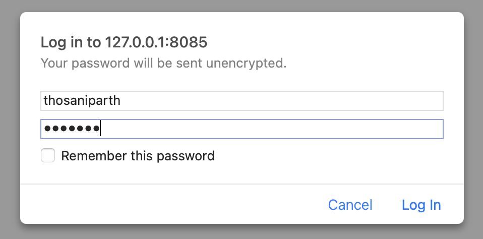      
      </a>
    </td>
    <td valign="left"> 
      
 2.This is the main Cmyplot web page
      

      <a href="./docs/images/home_page.png">
        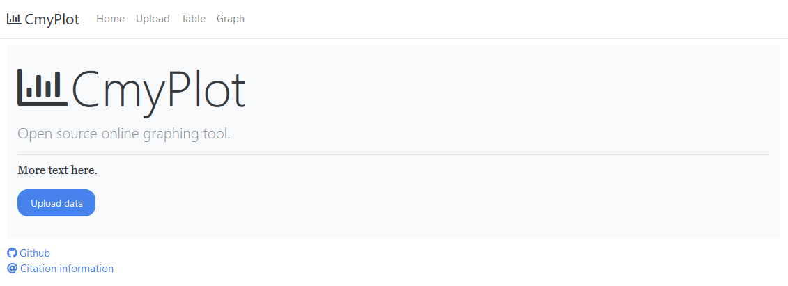 
      </a>
    </td>
  </tr>

<table border="2" bordercolorlight="#b9dcff" bordercolordark="#006fdd">

  <tr style="background: #010203 ">
    <td valign="left"> 
      
 3.You have an option to upload your csv file 
        by Drag and drop or click 
      

      <a href="./docs/images/pre_upload.png"> 
        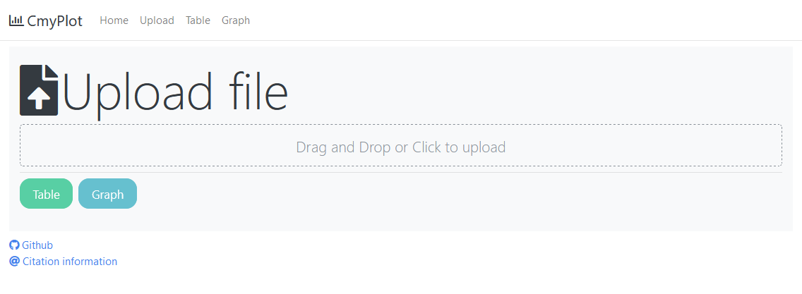      
      </a>
    </td>
    <td valign="left"> 
      
 4.You have an option to upload your csv file 
        by Drag and drop or click
      

      <a href="./docs/images/post_upload.png">
        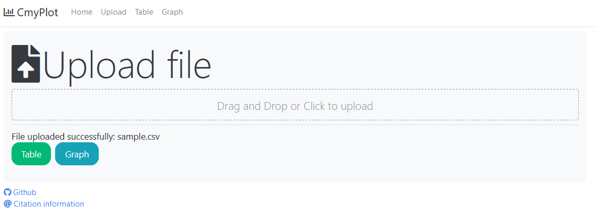 
      </a>
    </td>
  </tr>
  
  <tr style="background: #010203;"> 
    <td valign="left">
      
 5.You have an option to upload your csv file 
        by Drag and drop or click
      
  
      <a href="./docs/images/table.png">
        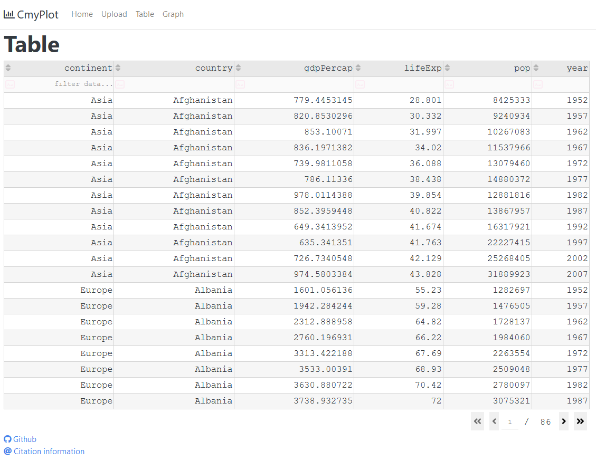    
      </a>
    </td>
    <td valign="left"> 
      
 6.For table, you could use 
      number of rows you want to display per page
      

      <a href="./docs/images/row_count_table.png">
        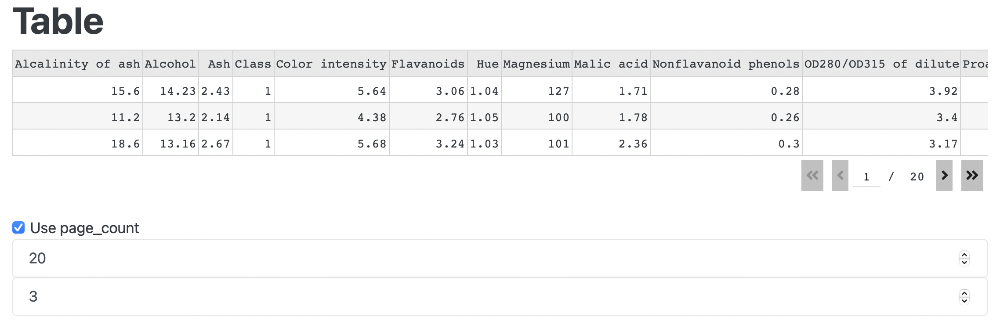          
      </a>
    </td>

  </tr> 
  
  <tr style="background: #010203;"> 
    <td valign="left">
     
 7.Table representation of the data
      

     <a href="./docs/images/table_filtered.png">
        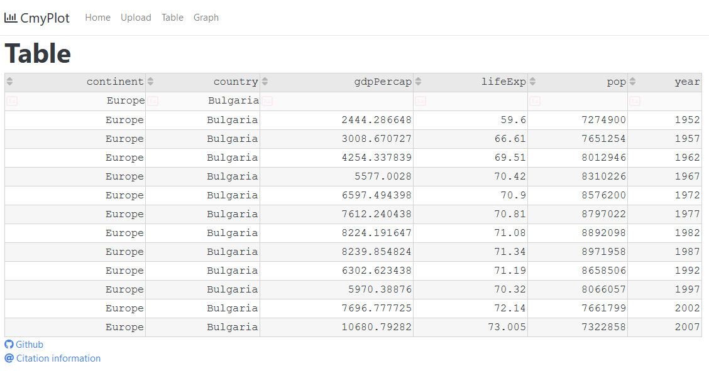 
      </a> 
    </td> 
    <td valign="left">
     
 8.Graph representation of the data
      

     <a href="./docs/images/graph_filled.png">
        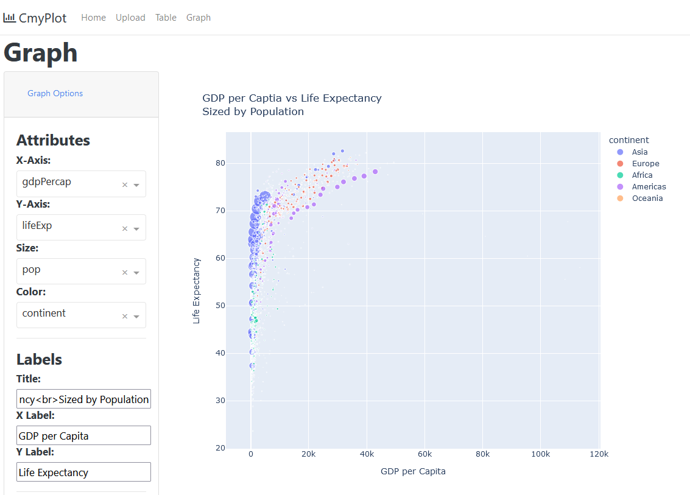 
      </a> 
    </td> 
  </tr> 
  
  <tr style="background: #010203;"> 
    <td valign="left">
     
 9.Data information - Mean, Median, Standard Deviation
      

     <a href="./docs/images/graph_information.png">
        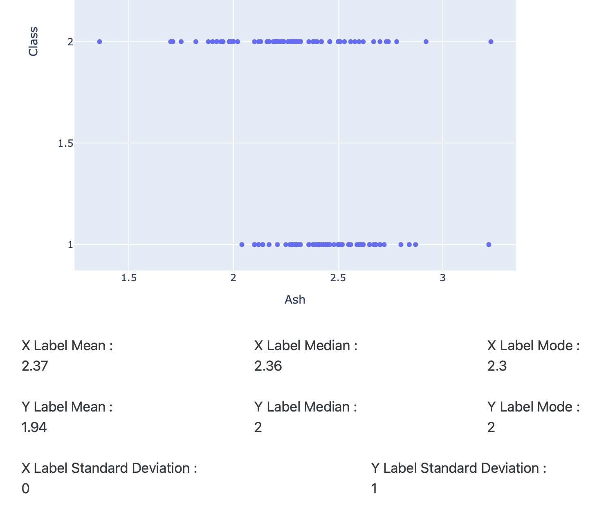 
      </a> 
    </td> 
    <td valign="left">
     
 10.Data attributes to be displayed in tooltip
      

     <a href="./docs/images/hover_options.png">
        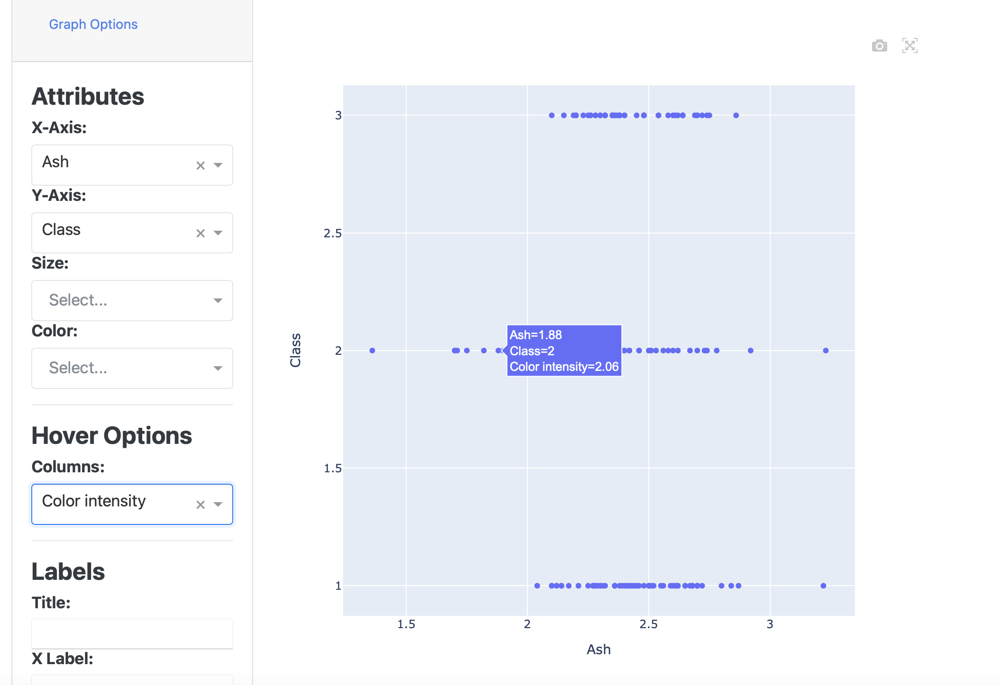 
      </a> 
    </td> 
  </tr> 
  
  <tr style="background: #010203;"> 
    <td valign="left">
     
 11.You can select graph type from the filters - Bar chart
      

     <a href="./docs/images/barchart.png">
        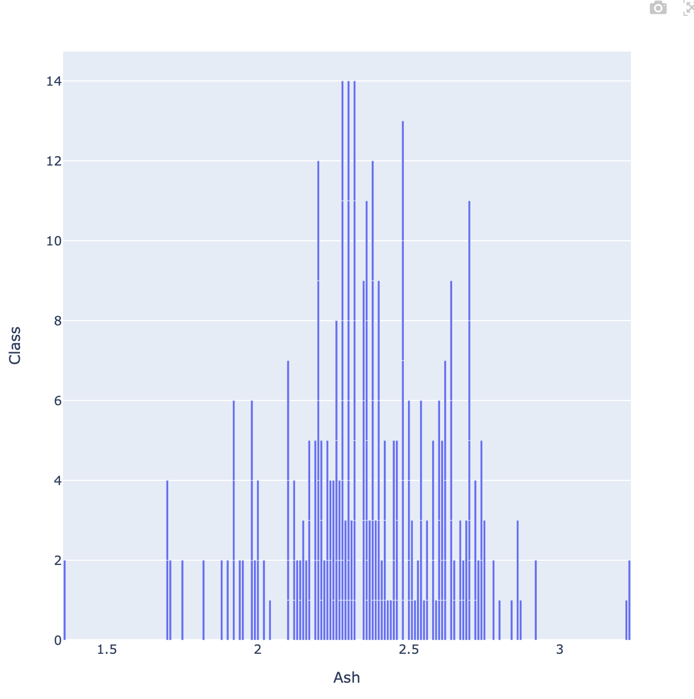 
      </a> 
    </td> 
    <td valign="left">
     
 12.You can select graph type from the filters - Line chart
      

     <a href="./docs/images/linechart.png">
        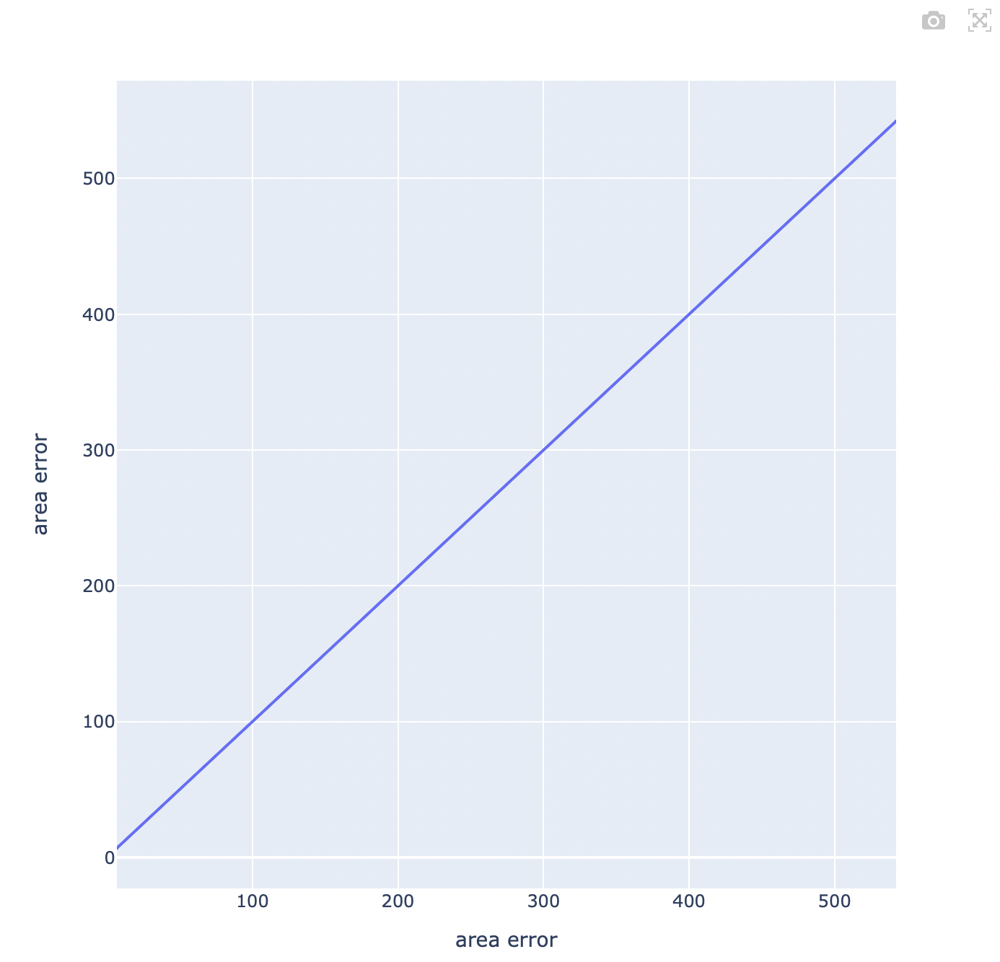 
      </a> 
    </td> 
  </tr> 
  
  <tr style="background: #010203;"> 
    <td valign="left">
     
 13.Share graph via email with a message
      

     <a href="./docs/images/email.jpg">
        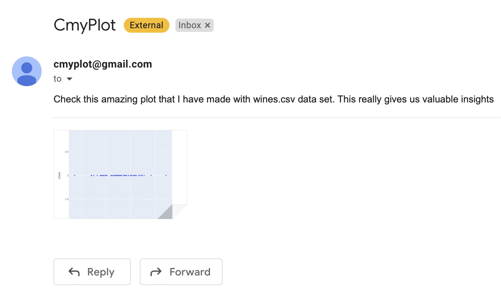 
      </a> 
    </td> 
    <td valign="left">
     
 14.Email
      

     <a href="./docs/images/share_graph.png">
        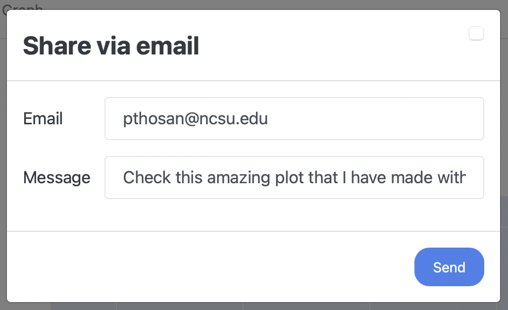 
      </a> 
    </td> 
  </tr> 

  <!-- <tr style="background: #010203;"> 
    <td valign = "center">
      
    </td>
    
  </tr>  -->
 </table>
   
## Getting started:

  - ### Prerequisite: 
      - Download [Python3.x](https://www.python.org/downloads/) on your system.

   - ### Installation:
      E.g If you downloaded `Python 3.9.7` above, then

      **Steps to setup virtual environment**
     - Create a virtual environment:

        `python3.9 -m venv project1_env`
    
     - Activate the virtual environment: 

        `source project1_env/bin/activate`
    
     - Build the virtual environment:(must be present in project directory)

        `pip install -r requirements.txt`

  - ### Run Instructions <a name="Instructions">

     **To run/test the site locally:**

     - Clone [this (CmyPlot) github repo](https://github.com/thosaniparth/CmyPlot).

     - Navigate to project directory.

     - Create a virtual environment:

        `python -m venv project1_env`
    
     - Activate the virtual environment: 

        `source project1_env/bin/activate`
    
     - Build the virtual environment:

        `pip install -r requirements.txt`

     - Install CmyPlot as package, this step is required due to the testing framework:

        `pip install -e .`
  
     - Run:
     
        `python src/plotting/index.py`

     - Site will be hosted at:
     
        `http://127.0.0.1:8085/`
       
## What's new in Phase 2? <a name="Phase2">
  - Implemented Collaborative Work - Sharing of the images of plots to other users via email
  - Support for more graphs in the application - Added Line, Bar Graphs
  - Informative Graphs - Added more information to the graphs such as central tendencies 
  - Implemented Authentication - Added method for authenticating the users via user name and password
  - Additional details on the hover of the graph - Users can select columns to view and get data on hover of the points on the graph
  - Dynamic rows on pages - Users can select the number of rows they want to see on a particular page and also can change the number of pages
  ## Roadmap <a name="FutureScope">
   - [List of Roadmap and their corresponding open issues](https://github.com/thosaniparth/CmyPlot/issues/21)
       
## Team Members 
[Simran Bosamiya](https://github.com/BosamiyaSimran)

[Nisarg Shah](https://github.com/freakNewton)

[Parth Thosani](https://github.com/thosaniparth)
  
[Parth Jinturkar](https://github.com/ParthJinturkar)

